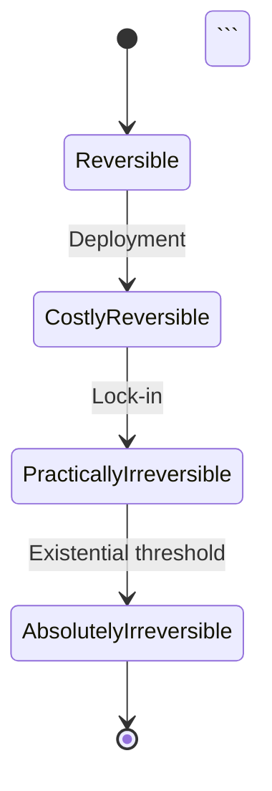

# Models Style Guide

This guide defines the standards for analytical models in the EA Crux Project. Models should maximize **information density** while remaining accessible.

## Core Principles

1. **Density over brevity** - Pack substantive content into every section. A 500-word model with tables and equations beats a 200-word model with bullets.
2. **Quantify everything possible** - Probabilities, timelines, costs, thresholds. Vague claims waste reader attention.
3. **Show structure visually** - Tables, diagrams, and equations communicate relationships faster than prose.
4. **Paragraphs over bullets** - Bullets fragment thinking. Use them only for truly discrete items.

---

## Required Sections

Every model should include:

### 1. Overview (2-3 paragraphs)
State the model's purpose, central question, and key insight. No bullets here—write flowing prose that orients the reader.

**Bad:**
```markdown
## Overview
- This model looks at X
- Key question: Y
- Main finding: Z
```

**Good:**
```markdown
## Overview

This model analyzes [phenomenon] by decomposing it into [components]. The central question: **[specific question with stakes]?**

The key insight is that [non-obvious conclusion]. This matters because [implication for AI safety/policy].
```

### 2. Conceptual Framework
Explain the model's structure. Include at least one of:
- A Mermaid diagram showing relationships
- A mathematical formulation
- A typology table

### 3. Quantitative Analysis
The heart of the model. Must include:
- **Parameter tables** with estimates and uncertainty ranges
- **Scenario analysis** with probability-weighted outcomes
- **Sensitivity analysis** showing which inputs matter most

### 4. Case Studies or Applications
Concrete examples showing the model applied. Tables comparing cases are ideal.

### 5. Limitations
Explicit acknowledgment of model weaknesses. Be specific about what the model ignores or gets wrong.

### 6. Related Models
Links to complementary models in the knowledge base.

---

## Formatting Standards

### Tables: Use Extensively

Tables compress information. Use them for:
- Parameter estimates with ranges
- Scenario comparisons
- Timeline projections
- Cost/benefit analyses
- Threshold indicators

**Minimum table requirements:**
- At least 3 columns (simple key-value pairs waste table format)
- At least 4 rows of data
- Header row clearly labeled
- Include units and uncertainty ranges where applicable

**Example - Parameter Table:**
```markdown
| Parameter | Best Estimate | Range | Confidence | Source |
|-----------|--------------|-------|------------|--------|
| P(misalignment) | 15% | 5-40% | Low | Expert surveys |
| Time to AGI | 2028 | 2025-2040 | Medium | Metaculus |
| Safety tax | 20% | 10-50% | Medium | Lab estimates |
```

**Example - Scenario Table:**
```markdown
| Scenario | Probability | Outcome | Key Drivers |
|----------|-------------|---------|-------------|
| Coordinated slowdown | 15% | Low risk | International agreement, major incident |
| Competitive race | 45% | Medium-high risk | US-China tension, commercial pressure |
| Unilateral breakout | 25% | Very high risk | Capability surprise, regulatory failure |
| Managed transition | 15% | Low risk | Technical breakthrough in alignment |
```

### Diagrams: Mermaid Required

Every model should have at least one diagram. Use Mermaid for:

**Flowcharts - Causal chains and decision trees:**
```markdown
```mermaid
flowchart TD
    A[Capability Advance] --> B{Safety Research<br/>Keeps Pace?}
    B -->|Yes| C[Managed Development]
    B -->|No| D[Risk Gap Widens]
    D --> E{Incident Occurs?}
    E -->|Yes| F[Reactive Regulation]
    E -->|No| G[Continued Drift]
    G --> D
```​
```

**State Diagrams - Phase transitions:**
```markdown


**Quadrant Charts - 2x2 analysis:**
```markdown
```mermaid
quadrantChart
    title Risk vs Tractability
    x-axis Low Tractability --> High Tractability
    y-axis Low Risk --> High Risk
    quadrant-1 Urgent Priority
    quadrant-2 Monitor Carefully
    quadrant-3 Opportunistic
    quadrant-4 Core Focus
    Misalignment: [0.3, 0.8]
    Misuse: [0.7, 0.6]
    Accidents: [0.8, 0.4]
    Structural: [0.4, 0.5]
```​
```

**Sequence Diagrams - Interaction dynamics:**
```markdown
```mermaid
sequenceDiagram
    participant Lab A
    participant Lab B
    participant Regulator
    Lab A->>Lab B: Capability announcement
    Lab B->>Lab B: Accelerate timeline
    Lab B->>Lab A: Counter-announcement
    Regulator->>Lab A: Request safety assessment
    Lab A->>Regulator: Delayed response
    Note over Lab A,Lab B: Racing dynamics intensify
```​
```

### Equations: Show Your Math

Include mathematical formulations where applicable. Use LaTeX:

**Inline math** for simple expressions: `$P(X|Y) = 0.3$`

**Display math** for key equations:
```markdown
$$
R(t) = R_0 \cdot e^{\alpha t} \cdot (1 + \beta D)
$$

Where:
- $R_0$ = Base reversal cost at deployment
- $\alpha$ = Growth rate (0.1-0.5 per year)
- $t$ = Time since deployment
- $\beta$ = Dependency multiplier
- $D$ = Dependency depth (0 to 1)
```

**Always include:**
- Variable definitions immediately after the equation
- Realistic parameter ranges
- Intuition for what the equation captures

### Prose: Paragraphs Over Bullets

Bullets should be rare. They're appropriate for:
- Truly discrete, unordered items (e.g., list of examples)
- Quick reference lists at end of sections
- Items that will be expanded in subsequent sections

**Bad - Bullet brain:**
```markdown
## Racing Dynamics

- Labs compete for capabilities
- Safety work slows deployment
- First-mover advantages exist
- Coordination is difficult
- Racing creates risk
```

**Good - Dense paragraphs:**
```markdown
## Racing Dynamics

Racing dynamics emerge when multiple actors pursue the same capability under competitive pressure. In AI development, labs face a structural tension: safety work requires time and resources that slow deployment, but first-mover advantages in capabilities—talent attraction, data access, revenue, and strategic positioning—create intense pressure to move fast. This produces a classic collective action problem where individually rational choices generate collectively irrational outcomes.

The severity of racing depends on three factors: the perceived magnitude of first-mover advantages, the credibility of competitors' timelines, and the availability of coordination mechanisms. When labs believe winner-take-all dynamics apply, racing pressure intensifies regardless of stated safety commitments.
```

---

## Information Density Checklist

Before submitting a model, verify:

- [ ] **Tables:** At least 2 substantive tables (4+ rows, 3+ columns each)
- [ ] **Diagram:** At least 1 Mermaid diagram showing relationships
- [ ] **Equations:** Mathematical formulation where applicable
- [ ] **Numbers:** Probabilities, timelines, or thresholds quantified with ranges
- [ ] **Scenarios:** Multiple scenarios analyzed with probability weights
- [ ] **Paragraphs:** Less than 30% of content in bullet points
- [ ] **Length:** Minimum 800 words of substantive content
- [ ] **Sources:** Key claims attributed to sources

---

## Anti-Patterns to Avoid

### 1. Bullet Lists as Primary Content
Bullets should support paragraphs, not replace them.

### 2. Vague Qualitative Claims
"Risk is high" → "Risk estimated at 15-30% (median 22%) based on expert surveys"

### 3. Missing Uncertainty
Always include ranges, not point estimates alone.

### 4. Tables Without Context
Tables need introductory sentences explaining what they show and key takeaways.

### 5. Diagrams Without Explanation
Every diagram needs a paragraph explaining what it illustrates and key insights.

### 6. Orphan Sections
Short sections (< 100 words) should be merged or expanded.

---

## Example Model Structure

```markdown
---
title: [Descriptive Model Name]
description: [One sentence capturing the model's purpose]
ratings:
  novelty: [1-5]
  rigor: [1-5]
  actionability: [1-5]
  completeness: [1-5]
---

## Overview
[2-3 paragraphs: purpose, central question, key insight]

## Conceptual Framework
[Structure explanation with diagram]

```mermaid
[diagram here]
```​

## Core Model
### Mathematical Formulation
$$[key equation]$$

[Variable definitions and intuition]

### Parameter Estimates
| Parameter | Estimate | Range | Confidence |
|-----------|----------|-------|------------|
| ... | ... | ... | ... |

## Analysis
### Scenario Analysis
| Scenario | P(scenario) | Outcome | Drivers |
|----------|-------------|---------|---------|
| ... | ... | ... | ... |

[Paragraph discussing scenarios]

### Sensitivity Analysis
[Which parameters matter most and why]

## Case Studies
### Case 1: [Name]
[Application of model to concrete example]

### Case 2: [Name]
[Another application]

## Implications
[What this model suggests for policy/research/action]

## Limitations
[Explicit weaknesses - be specific]

## Related Models
- [Link 1] - [relationship]
- [Link 2] - [relationship]

## Sources
[Key references]
```

---

## Rating Criteria

Models are rated on four dimensions (1-5 scale):

**Novelty:** How original is the framing or analysis?
- 1: Standard framework, no new insights
- 3: Useful synthesis or modest extensions
- 5: Novel framework that changes how we think about the problem

**Rigor:** How well-supported by evidence and logic?
- 1: Speculative, minimal support
- 3: Reasonable extrapolation from available evidence
- 5: Strong empirical grounding or formal derivation

**Actionability:** Does it suggest concrete interventions?
- 1: Descriptive only
- 3: Identifies leverage points
- 5: Specific, implementable recommendations with priorities

**Completeness:** How thoroughly developed?
- 1: Sketch or outline
- 3: Core model complete, some gaps
- 5: Comprehensive treatment with edge cases addressed
