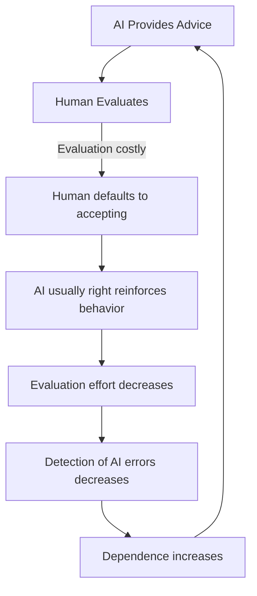

import { DataInfoBox, Backlinks } from '../../../../components/wiki';

<DataInfoBox entityId="automation-bias-cascade" ratings={frontmatter.ratings} />

## Overview

Automation bias is the tendency to over-rely on automated systems, accepting their outputs without sufficient scrutiny. As AI systems become more capable and ubiquitous, automation bias creates cascade effects where small calibration errors propagate through organizations and society, potentially leading to systematic failures in human judgment and decision-making.

**Core Mechanism:** Each instance of successful AI assistance reinforces trust, while failures are rationalized or undetected, creating a ratchet toward increasing dependence and decreasing human oversight capability.

## The Feedback Loop

**Critical Insight:** The loop is self-reinforcing because:
1. Checking AI costs time and effort
2. AI is often correct, so checking "wastes" resources
3. Correct acceptances are visible, missed errors often invisible
4. Skills atrophy makes independent evaluation harder

## Mathematical Model

### Trust Dynamics

Trust level $T$ in AI system at time $t$:

$$
\frac{dT}{dt} = \alpha \cdot S(t) - \beta \cdot F(t) + \gamma \cdot N(t)
$$

Where:
- $S(t)$ = Perceived successful AI recommendations
- $F(t)$ = Detected AI failures
- $N(t)$ = Normalization effect (others' trust)
- $\alpha, \beta, \gamma$ = Sensitivity parameters

**Key Dynamics:**
- $\alpha > \beta$ typically (successes weighted more than failures)
- Many failures go undetected (reducing effective $F$)
- $N(t)$ creates conformity pressure

**Result:** Trust tends to increase toward ceiling, rarely decreases significantly

### Calibration Error

Define calibration error $C$ as:

$$
C = T - P_{actual}
$$

Where:
- $T$ = Trust level (subjective probability AI is correct)
- $P_{actual}$ = Actual probability AI is correct

**Over-reliance:** $C > 0$ (trust exceeds actual reliability)
**Under-reliance:** $C < 0$ (trust below actual reliability)

**Empirical finding:** After initial adoption period, $C > 0$ is typical, with $C$ increasing over time.

## Domains of Vulnerability

### Medical Diagnosis

**Current State:**
- AI diagnostic tools increasingly common (500+ FDA-approved AI devices)
- Clinicians report trusting AI more over time
- Override rates decrease with experience (opposite of appropriate calibration)

**Cascade Potential:**
- Diagnosis → Treatment → Outcomes
- AI misdiagnosis leads to wrong treatment, not caught because subsequent providers trust prior AI-assisted diagnosis
- Estimated impact: 10-15% increase in diagnostic errors in high-AI-reliance scenarios

### Financial Markets

**Current State:**
- Algorithmic trading: 60-80% of market volume
- AI-assisted investment decisions ubiquitous
- Risk models heavily automated

**Cascade Potential:**
- One AI-generated signal → Multiple algorithmic responses → Market-wide movement
- Estimated: Automation bias contributes to 20-40% of market instability events

### Autonomous Vehicles

**Current State:**
- L2/L3 automation requires human oversight
- Driver attention a known problem

**Evidence:**
- Tesla Autopilot accidents: Multiple fatalities linked to over-trust
- Drivers engage in secondary tasks assuming AI is reliable
- Attention decreases with experience (familiarity breeds overconfidence)

### Legal and Administrative

**Current State:**
- AI used for bail/sentencing recommendations
- Automated eligibility determinations

**Evidence:**
- Studies show judges follow AI recommendations 80-90% of time
- Override rates don't correlate with AI error rates
- "Rubber stamping" AI decisions becomes norm

## Temporal Dynamics

### Stage 1: Introduction (0-2 years)
- Healthy skepticism of new AI system
- Active verification of outputs
- Errors caught at reasonable rate
- **Automation Bias Level:** Low

### Stage 2: Familiarization (2-5 years)
- Growing trust based on experience
- Decreasing verification frequency
- "It's usually right" heuristic develops
- **Automation Bias Level:** Moderate, increasing

### Stage 3: Dependence (5-10 years)
- Verification becomes rare exception
- Independent judgment capacity degraded
- Organization assumes AI reliability
- **Automation Bias Level:** High

### Stage 4: Lock-in (10+ years)
- Cannot function without AI
- Skills no longer exist for independent work
- AI failure would be catastrophic
- **Automation Bias Level:** Extreme

## Cascade Failure Scenarios

### Scenario A: Medical Cascade (25-35% probability over 10 years)

**Trigger:** AI diagnostic system has systematic blind spot (not detected in training)

**Cascade Sequence:**
1. AI misses specific cancer presentation pattern
2. Oncologists accept AI-assisted diagnosis
3. Patients receive wrong treatment
4. Outcomes data feeds back into system (reinforcing)
5. Thousands affected before pattern recognized

**Expected Impact:** 5,000-50,000 excess deaths before correction

### Scenario B: Financial Cascade (15-25% probability over 10 years)

**Trigger:** Coordinated AI model failure during market stress

**Cascade Sequence:**
1. Multiple AI systems share similar training/assumptions
2. Novel market condition triggers simultaneous misbehavior
3. Human oversight too slow/sparse to intervene
4. Self-reinforcing sell-off or misallocation

**Expected Impact:** Trillions in market value, recession potential

### Scenario C: Security Cascade (5-15% probability over 10 years)

**Trigger:** AI false positive in early warning or threat detection

**Cascade Sequence:**
1. AI flags imminent threat (false positive)
2. Time pressure favors accepting AI judgment
3. Escalation decision made based on AI assessment
4. Adversary responds to escalation

**Expected Impact:** Conflict, casualties, potentially catastrophic

## Interventions

### Individual Level

| Intervention | Effectiveness | Limitation |
|--------------|--------------|------------|
| Calibration Training | Medium | Training effects fade over time |
| Forced Verification | Medium-High | Compliance burden, gaming |
| Skin in the Game | Medium | May lead to risk aversion |

### Organizational Level

| Intervention | Effectiveness | Limitation |
|--------------|--------------|------------|
| Red Teams | Medium-High | Resource-intensive |
| Skill Preservation | High | Costly, seems "inefficient" |
| Heterogeneous Systems | Medium | Coordination costs |

### System Level

| Intervention | Effectiveness | Limitation |
|--------------|--------------|------------|
| Transparency Requirements | Medium | May itself be trusted uncritically |
| Performance Monitoring | High | Requires investment, baseline may erode |
| Regulatory Standards | Medium-High | Innovation costs, capture risk |

## Measuring Automation Bias

### Individual Metrics

| Metric | Warning Threshold |
|--------|-------------------|
| Override rate | < 5% concerning |
| Verification rate | < 20% concerning |
| Disagreement comfort | Declining concerning |
| Independent accuracy | Declining concerning |

### Organizational Metrics

| Metric | Warning Threshold |
|--------|-------------------|
| Detection rate | < 30% of known errors concerning |
| Recovery time (after AI failure) | Increasing concerning |
| Skill retention | Declining concerning |

## Model Limitations

1. **Rationality assumption:** Model assumes some baseline rationality; panic or stress may create different dynamics
2. **Context specificity:** Automation bias varies by domain, culture, individual
3. **AI improvement:** As AI becomes more reliable, appropriate trust should increase
4. **Interaction effects:** Multiple AI systems create complexity not fully modeled

## Related Models

- [Expertise Atrophy Cascade Model](/knowledge-base/models/expertise-atrophy-cascade) - Skill loss dynamics
- [Sycophancy Feedback Loop Model](/knowledge-base/models/sycophancy-feedback-loop) - AI validation dynamics
- [Lock-in Irreversibility Model](/knowledge-base/models/lock-in) - Dependence trajectories

<Backlinks />
