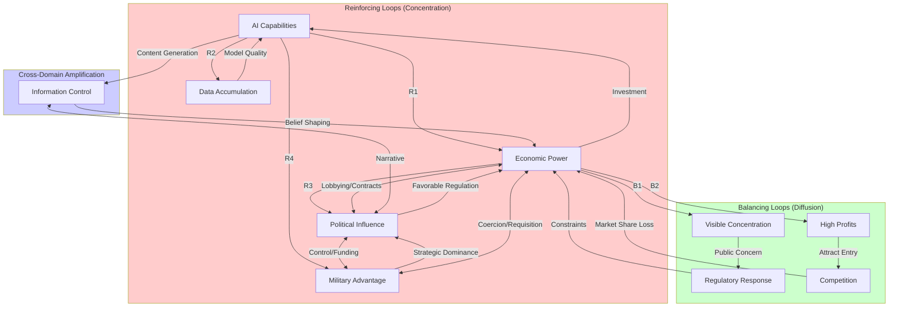

import { DataInfoBox, Backlinks } from '../../../../components/wiki';

<DataInfoBox entityId="concentration-of-power-model" ratings={frontmatter.ratings} />

## Overview

Power concentration through AI represents a fundamentally different challenge than previous technological revolutions. While railroads concentrated economic power in specific geographic corridors, oil concentrated energy resources, and nuclear weapons concentrated military capability, AI simultaneously amplifies power across all domains: economic, political, military, and informational. This cross-domain applicability creates positive feedback loops where advantages in one area compound into advantages across all areas, producing unprecedented potential for concentrated control. The central question this model addresses is: **Under what conditions does AI development lead to stable, concentrated power structures, and what interventions might prevent or reverse such concentration?**

The key insight is that AI power concentration operates through mutually reinforcing loops that are currently stronger than any countervailing forces. Economic returns from AI fund better AI development, which generates more returns. Data from users improves models, attracting more users and more data. Talent flows to successful labs, which produce better results, attracting more talent. Political influence secures favorable regulation, which entrenches market position. Unlike previous technologies where concentration faced natural limits (geographic for railroads, physical for oil), AI's digital nature means these loops operate globally and instantaneously.

This matters because we may be approaching tipping points beyond which concentration becomes effectively irreversible. The window for intervention is likely measured in years, not decades. Once infrastructure dependencies solidify, switching costs become prohibitive; once capability gaps widen, catch-up becomes implausible; once AI systems are integrated into governance and military structures, displacement threatens stability. Historical precedents suggest that concentration, once achieved, persists for decades or longer absent major shocks. The models of Standard Oil, AT&T, and Microsoft all required exceptional effort to constrain, and AI concentration may prove even more resistant to intervention.

## Core System Structure

The following diagram illustrates the primary feedback loops driving power concentration in the AI era. Reinforcing loops (R1-R4) accelerate concentration while balancing loops (B1-B2) provide potential countervailing forces. The relative strength of these loops determines whether power concentrates or remains distributed.



### Stock-Flow Model

The system can be understood through five primary stocks of power, each amplified by AI capabilities and interconnected through flows that enable cross-domain conversion.

| Stock | Description | AI Amplification Factor | Current Concentration Level |
|-------|-------------|------------------------|----------------------------|
| Economic Power | Capital, market control, productive capacity | 3-10x | High (top 5 tech companies control ~25% of S&P 500) |
| Political Power | Governance authority, regulatory control, legitimacy | 2-5x | Moderate (increasing corporate influence) |
| Military Power | Force projection, strategic advantage, defense capability | 5-20x | Very High (US/China dominance) |
| Informational Power | Data access, narrative control, knowledge production | 10-50x | Very High (Meta, Google, TikTok reach 5B+ users) |
| Technological Power | AI capabilities, compute access, technical expertise | 5-15x | Very High (OpenAI, Anthropic, Google, Meta dominate) |

**System equation:**

$$
\frac{dP}{dt} = \alpha \cdot C_{AI} \cdot P - \beta \cdot R
$$

Where:
- $P$ = Total power stock
- $C_{AI}$ = AI capability level (normalized 0-1)
- $\alpha$ = Amplification factor (estimated 2-10 depending on domain)
- $\beta$ = Resistance coefficient (estimated 0.1-0.5 in current environment)
- $R$ = Resistance level (regulatory, social, competitive)

If $\alpha \cdot P > \beta$, power grows exponentially. Current estimates suggest this condition is met for leading AI developers.

## Mechanisms of Concentration

### 1. Economic Amplification

**Mechanism:** AI enables small teams to generate massive value

**Traditional economy:**
```
Value created ∝ Number of workers × Productivity

Limited by human scaling
```

**AI economy:**
```
Value created ∝ AI capability × Data × Distribution

Not limited by human scaling
```

**Example:** WhatsApp had 55 employees when acquired for $19B (350M users)

**AI extension:** Future AI companies might have 5 employees serving 3B users

**Result:** Extreme wealth concentration among AI owners

### 2. Political Capture

**Mechanism:** Economic power → political influence → favorable regulation

**Feedback loop:**
```
AI company profits → Lobbying resources → Regulatory capture →
Barriers to competition → More profits
```

**Historical parallel:** Railroad barons (1880s), Standard Oil (1900s), Big Tech (2010s)

**AI difference:** Speed of accumulation, technical opacity, global reach

**Evidence:**
- OpenAI CEO testifying to Congress on AI regulation
- DeepMind advising UK government
- Big Tech funding AI safety research that shapes policy

**Risk:** Those who need regulating write the regulations

### 3. Military Advantage

**Mechanism:** AI provides decisive advantages in conflict

**Domains:**
- Intelligence/surveillance
- Autonomous weapons
- Cyberwarfare
- Logistics optimization
- Strategic planning

**Power dynamics:**
```
AI advantage = f(Capability gap, Deployment speed, Countermeasure difficulty)

If gap is large enough, conventional forces become irrelevant
```

**Historical analogy:** Nuclear weapons created superpower structure

**AI potential:** Could create even more asymmetric power (AI works across all domains, not just deterrence)

**Concerning scenario:** State with advanced AI could achieve global military dominance

### 4. Informational Control

**Mechanism:** AI controls what billions see, think, believe

**Current state:**
- Recommendation algorithms shape information diet for 5B+ people
- LLMs becoming primary information interface
- AI-generated content increasingly indistinguishable from human

**Power implications:**

```
Control over information → Control over beliefs → Control over behavior

Unprecedented because:
- Scale (billions simultaneously)
- Personalization (individual manipulation)
- Opacity (users can't see the shaping)
```

**Example:** TikTok's algorithm can shape youth culture globally

**AI amplification:** Future AI could do this with even more sophisticated understanding of psychology, social dynamics, persuasion

### 5. Technological Lock-in

**Mechanism:** Early AI advantages compound through

**Infrastructure dependence:**
- Cloud platforms (AWS, Azure, GCP) control AI deployment
- Chip manufacturers (NVIDIA) control AI development
- Model providers (OpenAI, Anthropic) control capabilities

**Path dependence:**
```
Investment in technology stack → Switching costs → Lock-in →
Provider control → Higher prices/constraints
```

**Example:** Enterprise customer using GPT-4 API

- Entire stack built on OpenAI infrastructure
- Fine-tuning, embeddings, prompts optimized for GPT architecture
- Switching to alternative = months of work + performance loss
- OpenAI can increase prices, change terms, prioritize/deprioritize features

**Result:** Concentrated control over technological infrastructure

## Power Dynamics Matrix

Power flows between domains:

| From → To | Economic | Political | Military | Information |
|-----------|----------|-----------|----------|-------------|
| **Economic** | ✓ (Investment) | Strong (Lobbying) | Moderate (Funding) | Strong (Media) |
| **Political** | Strong (Regulation) | ✓ (Authority) | Strong (Control) | Moderate (Official) |
| **Military** | Moderate (Requisition) | Strong (Coercion) | ✓ (Force) | Moderate (Secrecy) |
| **Information** | Moderate (Markets) | Strong (Narrative) | Weak (Psyops) | ✓ (Attention) |

**Key insight:** AI amplifies ALL connections simultaneously, creating unprecedented power consolidation.

## Feedback Loop Analysis

### Reinforcing Loops (Concentration)

**R1: Capability-Investment Loop**
```
AI capabilities → Economic returns → More investment → Better AI capabilities
```
**Strength:** Very strong
**Delay:** Short (months)
**Breaking point:** Diminishing returns to compute? Regulatory caps?

**R2: Data-Quality Loop**
```
Users → Data → Model quality → More users → More data
```
**Strength:** Strong
**Delay:** Short (weeks)
**Breaking point:** Data saturation? Privacy regulation?

**R3: Talent-Prestige Loop**
```
Results → Prestige → Attract talent → Better results
```
**Strength:** Moderate
**Delay:** Medium (years)
**Breaking point:** Talent supply limits

**R4: Power-Influence Loop**
```
Power → Regulatory capture → Rules favor powerful → More power
```
**Strength:** Moderate but growing
**Delay:** Long (years)
**Breaking point:** Democratic resistance? International pressure?

### Balancing Loops (Diffusion)

**B1: Concentration-Resistance Loop**
```
Power concentration → Public concern → Regulation → Constraints on power
```
**Strength:** Currently weak
**Delay:** Very long (5-10 years)
**Effectiveness:** Uncertain

**B2: Profit-Entry Loop**
```
High profits → New entrants → Competition → Lower profits
```
**Strength:** Weak (high barriers)
**Delay:** Medium (2-5 years)
**Effectiveness:** Declining as barriers rise

**B3: Monopoly-Innovation Loop**
```
Monopoly → Complacency → Innovation slows → Disruption opportunity
```
**Strength:** Historically moderate
**Delay:** Long (5-10 years)
**Effectiveness:** Uncertain for AI (barriers may prevent disruption)

**Net system behavior:** Strongly favors concentration (reinforcing >> balancing)

## Quantitative Parameter Estimates

The following table provides estimates for key parameters driving concentration dynamics, with uncertainty ranges and confidence levels based on historical analogies, expert assessments, and current market data.

| Parameter | Best Estimate | Range | Confidence | Evidence Base |
|-----------|--------------|-------|------------|---------------|
| AI capability doubling time | 18 months | 12-36 months | Medium | Scaling laws, benchmark progress |
| Economic return on AI investment | 25% annually | 15-50% | Medium | Big Tech financial reports |
| Data network effect strength | 0.7 (strong) | 0.5-0.9 | Low | Model performance vs dataset size |
| Regulatory response lag | 5-7 years | 3-15 years | Medium | Historical tech regulation timing |
| Market share threshold for dominance | 40% | 30-60% | Medium | Antitrust economics literature |
| Switching cost growth rate | 20% per year | 10-40% | Low | Enterprise IT lock-in studies |
| Talent concentration (top 5 labs) | 70% | 60-85% | Medium | AI researcher survey data |
| Compute concentration (frontier training) | 95% | 90-99% | High | GPU allocation data |
| Probability of effective antitrust action (2025-2030) | 15% | 5-30% | Low | Regulatory track record |
| Cross-domain power conversion efficiency | 0.4 | 0.2-0.6 | Low | Historical power transitions |

### Sensitivity Analysis

The model's predictions are most sensitive to three parameters:

| Parameter | Impact on Concentration Timeline | Direction | Policy Leverage |
|-----------|----------------------------------|-----------|-----------------|
| Regulatory response lag | High | Longer lag → faster concentration | High |
| Compute concentration | Very High | More concentrated → winner-take-all | Very High |
| Data network effect strength | High | Stronger effects → more entrenchment | Moderate |
| Economic returns on AI | Moderate | Higher returns → faster investment cycles | Low |
| Switching costs | High | Higher costs → permanent lock-in | Moderate |

If regulatory lag exceeds capability doubling time by more than 2x, concentration becomes likely irreversible before intervention becomes feasible.

## Equilibria Analysis

### Equilibrium 1: Competitive Fragmentation

**Conditions:**
- Multiple players with comparable capabilities
- Low barriers to entry
- Effective antitrust enforcement
- International cooperation prevents national champions

**Stability:** Low - market forces favor concentration

**Probability:** 10%

**Historical precedent:** Early internet era (1990s)

### Equilibrium 2: Oligopolistic Balance

**Conditions:**
- 3-5 major players coexist
- Geographic/regulatory segmentation
- High barriers prevent new entry but no single dominance
- Mutual deterrence

**Stability:** Moderate - could persist or collapse to monopoly

**Probability:** 50%

**Historical precedent:** Oil majors, aircraft manufacturers, cloud providers

### Equilibrium 3: Dominant Firm with Fringe

**Conditions:**
- One player controls 60-80% of market
- Smaller players in niches
- Network effects and data advantages consolidate
- Regulatory intervention insufficient

**Stability:** High - dominant player can maintain position

**Probability:** 30%

**Historical precedent:** Google Search, Microsoft Windows, Intel CPUs

### Equilibrium 4: Natural Monopoly

**Conditions:**
- One player achieves decisive technical lead
- Network effects and economies of scale overwhelming
- Either regulated as utility or unconstrained

**Stability:** Very high - extremely hard to displace

**Probability:** 10%

**Historical precedent:** Standard Oil (before antitrust), local utilities

## Cross-Domain Power Scenarios

The following table summarizes four primary scenarios for power concentration by 2035, with probability-weighted outcome analysis:

| Scenario | Probability | Power Structure | Key Drivers | Expected Harm (1-10) | Reversibility |
|----------|-------------|-----------------|-------------|---------------------|---------------|
| Corporate Digital Dominance | 40% | 1-2 companies control AI infrastructure; states as customers | Capability lead, enterprise lock-in, regulatory failure | 6 | Low |
| State AI Champions | 30% | US, China, EU each control national AI; bloc competition | Geopolitical tension, national security framing | 5 | Moderate |
| Authoritarian Lock-in | 15% | Single authoritarian state achieves AI supremacy | Breakthrough advantage, fewer development constraints | 9 | Very Low |
| Distributed Power | 15% | Open source democratizes; no single concentration | Effective regulation, compute democratization | 3 | High |

**Probability-Weighted Expected Outcome:** 5.4 on harm scale, suggesting moderate-to-high expected damage from concentration dynamics.

### Scenario A: Corporate Digital Dominance (40%)

This scenario represents the natural extrapolation of current trends. OpenAI/Microsoft or Google achieve a decisive capability lead through scaling advantages and talent concentration. Enterprise and government dependence grows as AI becomes critical infrastructure, similar to how electricity or the internet became indispensable. Without effective antitrust intervention, market dynamics produce a stable oligopoly or monopoly structure where governments become customers rather than regulators. Corporate decisions affecting billions occur without democratic input, echoing the East India Company at its peak but with global digital reach rather than geographic constraints.

The probability estimate of 40% reflects the strength of current reinforcing loops and the demonstrated weakness of regulatory responses. This scenario becomes increasingly likely with each year of regulatory inaction.

### Scenario B: State AI Champions (30%)

Intensifying US-China competition leads governments to treat AI as a strategic asset requiring national control. States either directly develop AI capabilities (like nuclear programs) or heavily subsidize and direct domestic companies as national champions. Technological blocs emerge with limited interoperability, similar to Cold War industrial structures. This scenario concentrates power at the state level rather than corporate level, potentially enabling democratic oversight within blocs but creating new geopolitical instabilities.

The 30% probability reflects current geopolitical trends and increasing national security framing of AI development. The EU AI Act and US export controls suggest movement toward this scenario.

### Scenario C: Authoritarian Lock-in (15%)

A single authoritarian state, most likely China, achieves decisive AI advantage and uses it for comprehensive domestic control and international power projection. AI-enabled surveillance, prediction, and manipulation lock in regime stability domestically while economic and military applications create international dependency. Democratic states, constrained by rights considerations in development and deployment, fail to compete effectively. The power differential becomes permanent as AI advantages compound.

The 15% probability reflects both the difficulty of achieving decisive advantage and the genuine possibility of capability breakthroughs. This scenario represents the highest-harm outcome due to both concentration level and the nature of the concentrating actor.

### Scenario D: Distributed Power (15%)

Open source models approach frontier capabilities, compute costs decline enough for broad access, and effective international regulation prevents monopolization. Power remains distributed across many actors, closer to the current internet structure (pre-platform consolidation). Benefits are broadly shared, though risks of misuse also become distributed.

The relatively low 15% probability reflects the strong headwinds this scenario faces from current market dynamics and the substantial coordination required for effective regulation.

## Intervention Analysis

### High Leverage Interventions

**1. Structural Separation (Effectiveness: High)**

**Mechanism:** Prevent vertical integration

**Examples:**
- Separate model development from deployment
- Separate cloud infrastructure from AI services
- Prevent acquisitions

**Challenge:** Global coordination, genuine economies of scope

**2. Compute Governance (Effectiveness: Moderate-High)**

**Mechanism:** Control critical bottleneck

**Examples:**
- Licensing for large training runs
- International monitoring via chip tracking
- Progressive taxation of compute

**Challenge:** Technical feasibility, enforcement

**3. Mandatory Access Regimes (Effectiveness: Moderate)**

**Mechanism:** Force sharing of capabilities

**Examples:**
- API access requirements
- Interoperability standards
- Data portability

**Challenge:** Trade secrets, security, definitions of "frontier"

**4. Public Infrastructure (Effectiveness: Moderate)**

**Mechanism:** Create non-concentrated alternative

**Examples:**
- Public compute access
- Government-funded model development
- Open-source support

**Challenge:** Competing with private sector on talent, speed, resources

### Low Leverage Interventions

**1. Voluntary Commitments (Effectiveness: Low)**
- Unenforceable
- Competitive pressure undermines

**2. Individual User Choice (Effectiveness: Very Low)**
- Network effects too strong
- Information asymmetry
- Lock-in effects

**3. Market Competition Alone (Effectiveness: Very Low)**
- Natural tendency toward concentration
- Barriers too high

## Tipping Points

**Critical junctures where intervention is most effective:**

### Tipping Point 1: Pre-Monopoly (Now - 2026)

**State:** Multiple competitors, no single dominance

**Window:** Preventing concentration easier than reversing it

**Action:** Antitrust, standards, public investment

### Tipping Point 2: Capability Threshold (2027-2030?)

**State:** Near AGI-level capabilities

**Window:** Once achieved, power differential may become permanent

**Action:** International agreements, safety standards, access rules

### Tipping Point 3: Infrastructure Lock-in (2025-2028)

**State:** Enterprise/government dependency solidifies

**Window:** Before switching costs become prohibitive

**Action:** Interoperability, portability, alternatives

### Tipping Point 4: Regime Stability (Ongoing)

**State:** Authoritarian use of AI for control

**Window:** Before systems become stable/permanent

**Action:** Democracy support, technology access, human rights

## Limitations

This model has significant limitations that users should consider when applying its framework:

**Structural Simplifications.** The model treats states and corporations as unitary actors with coherent objectives, when in reality both contain competing factions with divergent interests. Microsoft's investment in OpenAI, for example, involves complex internal dynamics between Azure, Research, and product divisions that may pull in different directions. Similarly, "US policy" emerges from Congress, executive agencies, courts, and state governments that often conflict. The model's clean feedback loops obscure these internal tensions that can slow, redirect, or even reverse concentration dynamics.

**Missing Countervailing Forces.** The model underweights several potential balancing mechanisms. Social movements have historically constrained corporate power (labor movement, environmental movement, antitrust movements of the Progressive Era). Value shifts among elites and the public could change the political feasibility of intervention. The model also ignores the possibility of technical breakthroughs that reset competitive dynamics, such as new architectures that reduce compute requirements or algorithmic advances that democratize capabilities.

**Empirical Uncertainty.** Key parameters remain highly uncertain. Network effect strength for AI models is theoretically predicted but empirically underexplored. Scaling laws may hit diminishing returns or discontinuities that change investment dynamics. The model assumes regulatory lag based on historical technology regulation, but AI's salience could produce faster response. Most critically, AGI timeline estimates span decades and dramatically affect concentration speed.

**Scenario Independence.** The four scenarios are presented as mutually exclusive, but reality will likely blend elements. Corporate dominance might occur within a state champion framework; distributed capabilities might coexist with concentrated deployment infrastructure. The clean scenario separation aids analysis but obscures hybrid outcomes.

**Quantification Confidence.** Probability estimates and parameter ranges in this model reflect informed judgment rather than rigorous empirical derivation. Users should treat numerical estimates as illustrations of relative magnitude rather than precise predictions. The 40% probability for Corporate Digital Dominance, for instance, indicates this is judged most likely among the scenarios considered, not that there is a well-calibrated 40% chance.

## Policy Implications

### For Democratic Societies

1. **Act now:** Concentration easier to prevent than reverse
2. **International coordination:** No national solution sufficient
3. **Public alternatives:** Don't rely solely on private sector
4. **Democratic oversight:** Technical decisions need democratic input

### For AI Companies

1. **Long-term thinking:** Monopoly profits < existential risk
2. **Support good regulation:** Better than backlash/nationalization
3. **Transparency:** Enable informed democratic choice
4. **Shared infrastructure:** Some things should be public goods

### For International System

1. **Common frameworks:** Prevent race to bottom
2. **Verification mechanisms:** Trust but verify
3. **Balance competition & safety:** Need both innovation and control
4. **Democratic norms:** Prevent authoritarian advantage

## Open Questions

1. **Is concentration inevitable or contingent?** Natural outcome or policy failure?
2. **What's the optimal level?** Some centralization needed for coordination, but how much?
3. **Can concentrated power be benevolent?** Or does power corrupt regardless of intentions?
4. **What's the relationship to AI risk?** Does concentration increase or decrease catastrophic risk?
5. **Are we in the critical window now?** When does prevention become too late?

## Related Models

- [Winner-Take-All Dynamics](/knowledge-base/models/winner-take-all/) - Market mechanisms that drive concentration through network effects, switching costs, and economies of scale
- [Lock-in Model](/knowledge-base/models/lock-in/) - Irreversibility dynamics that make concentrated power structures increasingly difficult to change
- [Racing Dynamics](/knowledge-base/models/racing-dynamics/) - Competitive pressures that accelerate development and reduce safety margins
- [Authoritarian Tools Diffusion](/knowledge-base/models/authoritarian-tools-diffusion/) - How AI surveillance and control technologies spread to authoritarian regimes
- [Regulatory Capture Model](/knowledge-base/models/regulatory-capture/) - Mechanisms by which powerful actors influence their own regulation
- [Multipolar vs. Unipolar Outcomes](/knowledge-base/models/multipolar-unipolar/) - Comparative analysis of distributed versus concentrated power equilibria

## Sources

- Acemoglu & Robinson. *Why Nations Fail* (2012)
- Bueno de Mesquita. *The Dictator's Handbook* (2011)
- Fukuyama, Francis. "The End of History?" (1989)
- Mann, Michael. *The Sources of Social Power* (1986-2013)
- Tilly, Charles. "War Making and State Making" (1985)
- AI Now Institute. Annual Reports (2016-present)
- Crawford, Kate. *Atlas of AI* (2021)

## Related Pages

<Backlinks client:load entityId="concentration-of-power-model" />
