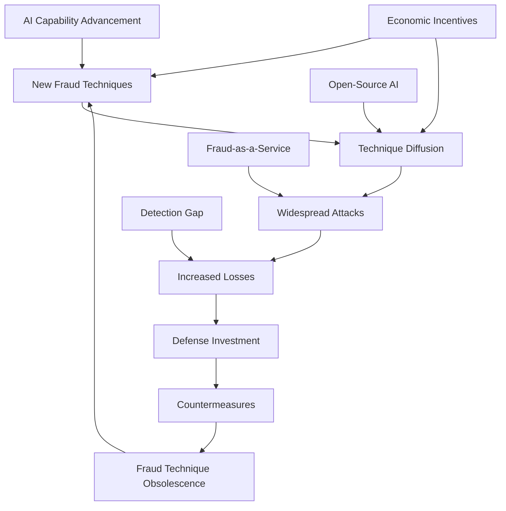

import { DataInfoBox, Backlinks } from '../../../../components/wiki';

<DataInfoBox entityId="fraud-sophistication-curve" ratings={frontmatter.ratings} />

## Overview

AI-enabled fraud is evolving along a sophistication curve that mirrors the technology adoption lifecycle but with unique dynamics. This model examines how fraud techniques advance from primitive automation to sophisticated multi-modal attacks, and projects the trajectory of this evolution.

**Core Question:** How quickly is AI-enabled fraud escalating in sophistication, and what capabilities should we expect at each stage?

## The Fraud Sophistication Ladder

Fraud capabilities can be organized into tiers based on technical sophistication and required resources:

| Tier | Capabilities | Resources Required | Current Status |
|------|--------------|-------------------|----------------|
| **Tier 1: Basic Automation** | Template phishing, simple chatbots | Open-source tools, minimal skill | Widespread |
| **Tier 2: Personalization** | LLM-crafted messages, scraped personal data | Commercial AI access, data aggregation | Growing rapidly |
| **Tier 3: Voice Cloning** | Real-time voice impersonation | Voice cloning APIs, seconds of audio | Active attacks documented |
| **Tier 4: Video Deepfakes** | Synthetic video calls, face swapping | Deepfake tools, training data | High-profile cases (2024) |
| **Tier 5: Multi-Modal Synthesis** | Coordinated voice + video + text, persistent personas | Multiple AI systems, orchestration | Emerging |
| **Tier 6: Autonomous Agents** | Fully automated attack chains, adaptive tactics | Agent frameworks, planning capabilities | Research stage |

## Historical Progression

### Pre-AI Era (Before 2019)
- Fraud required human effort per target
- Social engineering was a craft skill
- Scale limited by personnel
- Detection relied on pattern matching

### Early AI Era (2019-2022)
- First voice cloning fraud documented ($243K, 2019)
- LLMs began generating phishing content
- Deepfake technology emerged but was detectable
- Attacks remained semi-manual

### Current Era (2023-2025)
- Voice cloning from 3 seconds of audio
- Real-time deepfake video calls
- $25M Arup attack using full synthetic meeting
- 33% year-over-year increase in fraud losses
- Multiple high-profile CEO impersonation attempts

### Near-Term Projection (2026-2028)
- Autonomous fraud agents operating continuously
- Indistinguishable synthetic media
- Personalized attacks using comprehensive data profiles
- Multi-stage attacks building trust over weeks

## Key Variables

### V1: AI Capability Advancement Rate
The speed at which underlying AI capabilities improve, particularly in:
- Text generation quality and personalization
- Voice synthesis fidelity and real-time performance
- Video generation realism and consistency
- Multi-modal integration and coherence

**Current trajectory:** ~30% improvement per year across modalities

### V2: Fraud Technique Diffusion Rate
How quickly advanced techniques spread from sophisticated actors to commodity tools:
- Academic papers to open-source implementations
- State-sponsored tools to criminal markets
- Custom exploits to as-a-service offerings

**Current trajectory:** 12-18 months from novel technique to widespread availability

### V3: Defense Adaptation Speed
The lag between new fraud techniques and effective countermeasures:
- Detection system updates
- Employee training programs
- Authentication protocol changes
- Regulatory responses

**Current trajectory:** 18-36 months behind attack sophistication

### V4: Economic Incentives
The return on investment for fraud operations:
- Average take per successful attack
- Cost of attack infrastructure
- Risk of prosecution
- Scalability of successful techniques

**Current trajectory:** ROI increasing as automation reduces per-attack costs

## Key Relationships

### R1: Capability-to-Attack Lag
New AI capabilities are weaponized for fraud with a lag of 6-12 months. Voice cloning research from 2018 became fraud tools by 2019. GPT-4's 2023 release saw sophisticated phishing by late 2023.

### R2: Sophistication-Defense Gap
More sophisticated attacks face less mature defenses. Tier 5-6 attacks have essentially no reliable countermeasures currently. This gap incentivizes investment in advanced fraud.

### R3: Automation Multiplier
Each tier enables exponentially more targets:
- Tier 1: Thousands of targets per operator
- Tier 2-3: Tens of thousands
- Tier 4-5: Hundreds of thousands
- Tier 6: Millions (limited by target pool, not capacity)

## Scenario Analysis

### Scenario 1: Rapid Escalation (40% probability)

**Conditions:**
- Open-source AI continues rapid advancement
- Fraud-as-a-Service markets mature
- Defense investment lags
- Regulatory response slow

**2028 State:**
- Tier 5 attacks become commodity
- Tier 6 autonomous agents deployed
- Annual AI-enabled fraud exceeds $100B
- Traditional identity verification collapses

### Scenario 2: Gradual Escalation (35% probability)

**Conditions:**
- AI capability advancement slows
- Defense investment accelerates
- Some regulatory friction
- Fraud-as-a-Service markets disrupted

**2028 State:**
- Tier 4 attacks widespread, Tier 5 emerging
- Annual losses ~$60-80B
- Detection keeps partial pace
- Some verification methods remain reliable

### Scenario 3: Defense Breakthrough (15% probability)

**Conditions:**
- Provenance systems (C2PA) achieve adoption
- AI detection significantly improves
- Strong regulatory requirements
- International coordination on enforcement

**2028 State:**
- Authenticated communications become norm
- AI-generated content reliably flagged
- Fraud growth rate slows
- Losses plateau around $40-50B

### Scenario 4: Catastrophic Escalation (10% probability)

**Conditions:**
- Major fraud success enables even larger operations
- Criminal organizations achieve AI research capability
- State-sponsored fraud tools proliferate
- Complete authentication collapse

**2028 State:**
- Tier 6 attacks deployed at scale
- Annual losses exceed $200B
- Many online transactions become impossible
- Major economic disruption

## Quantitative Projections

### Fraud Loss Trajectory

| Year | Total AI Fraud Losses | Dominant Attack Tier | Detection Rate |
|------|----------------------|---------------------|----------------|
| 2023 | $12B | Tier 2-3 | 70% |
| 2024 | $17B | Tier 3 | 65% |
| 2025 | $25B | Tier 3-4 | 60% |
| 2026 | $40B | Tier 4 | 55% |
| 2027 | $55B | Tier 4-5 | 50% |
| 2028 | $75B | Tier 5 | 45% |

### Attack Success Rate by Tier

| Tier | 2024 Success Rate | 2026 Projected | 2028 Projected |
|------|-------------------|----------------|----------------|
| Tier 1 | 2% | 1% | 0.5% |
| Tier 2 | 5% | 4% | 3% |
| Tier 3 | 12% | 15% | 18% |
| Tier 4 | 20% | 25% | 30% |
| Tier 5 | 35% | 40% | 45% |
| Tier 6 | N/A | 50% | 55% |

## Inflection Points

### Critical Threshold 1: Real-Time Multi-Modal Synthesis
When attackers can generate coordinated voice, video, and text in real-time conversations, detection becomes exponentially harder. **Estimated timing:** 2025-2026.

### Critical Threshold 2: Autonomous Agent Deployment
When fraud operations can run continuously without human intervention, scale becomes unlimited. **Estimated timing:** 2026-2027.

### Critical Threshold 3: Authentication Collapse
When no reliable method exists to verify identity in digital communications. **Estimated timing:** 2027-2029 (preventable with provenance systems).

## Implications

### For Individuals
- Personal verification protocols essential (code words, out-of-band confirmation)
- Assume any unsolicited contact could be synthetic
- Increase skepticism proportional to request magnitude
- Prepare for "trust no one" communication environment

### For Organizations
- Multi-factor verification for high-value transactions mandatory
- Employee training must continuously update
- Technical detection necessary but insufficient
- Business process redesign to limit fraud exposure
- Consider fraud insurance as baseline cost

### For Policymakers
- Regulatory frameworks needed for AI fraud tools
- International cooperation essential (fraud is cross-border)
- Mandate provenance systems for critical communications
- Fund research into fraud-resistant authentication

## Model Limitations

1. **Prediction Uncertainty:** Fraud techniques evolve unpredictably
2. **Hidden Losses:** Many fraud incidents go unreported
3. **Defense Innovation:** Breakthrough countermeasures could shift dynamics
4. **Regulatory Impact:** Strong policy interventions could alter trajectory

## Related Models

- [Fraud Detection Arms Race Model](/knowledge-base/models/fraud-detection-arms-race) - Competition between fraud and detection
- [Deepfakes Authentication Crisis Model](/knowledge-base/models/deepfakes-authentication-crisis) - Synthetic media and identity verification
- [Disinformation Detection Arms Race Model](/knowledge-base/models/disinformation-detection-race) - Analogous dynamics in content authenticity

<Backlinks />
