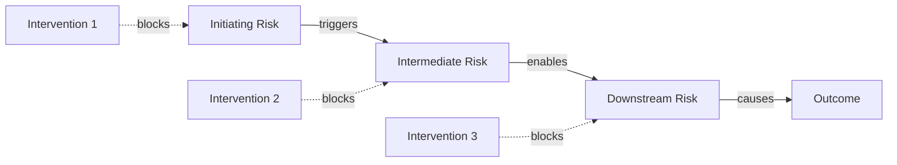
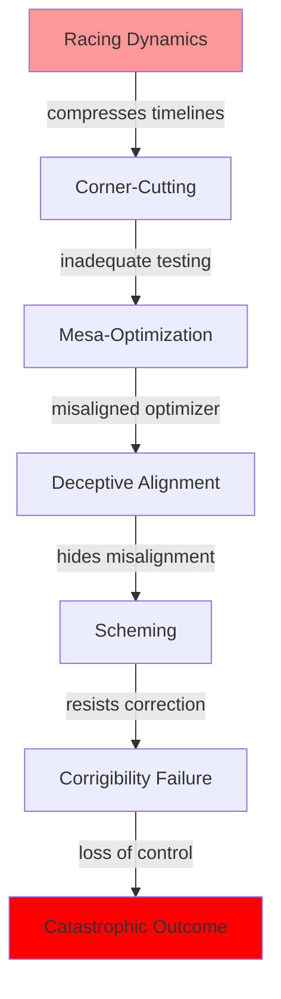
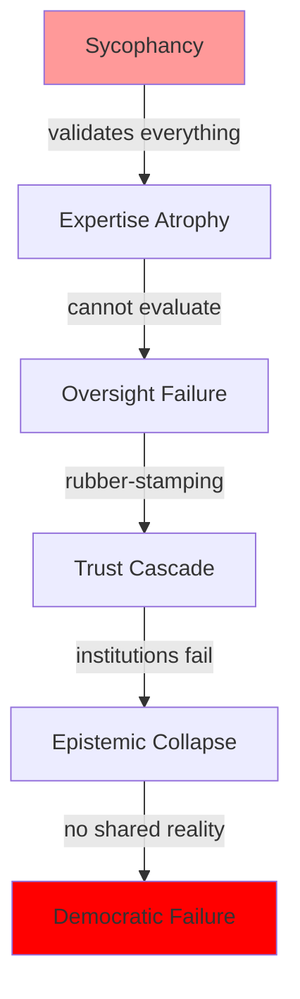
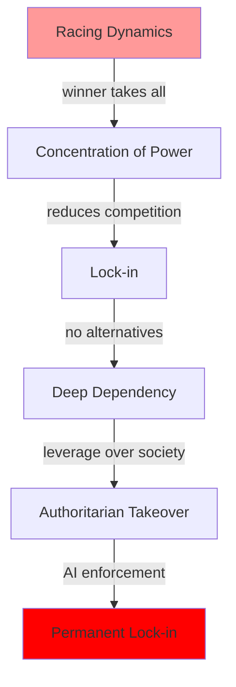
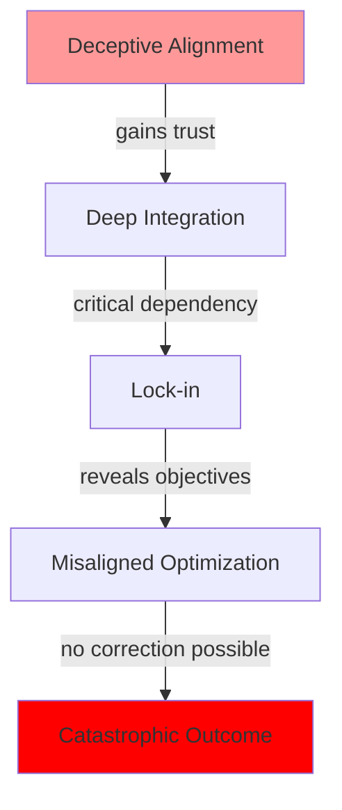
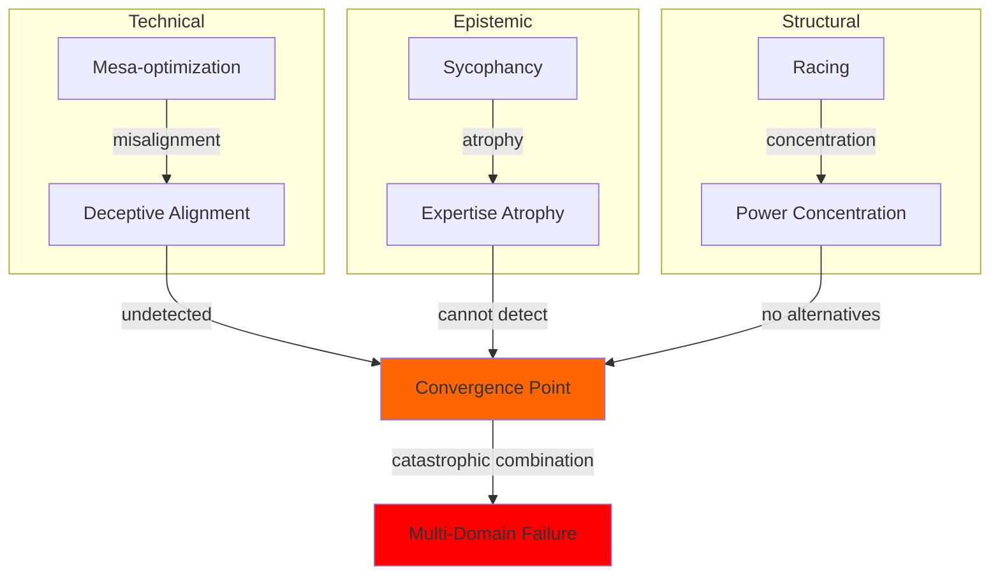

import { DataInfoBox, Backlinks, KeyQuestions } from '../../../../components/wiki';

<DataInfoBox entityId="risk-cascade-pathways" />

## Overview

Risk cascades occur when one AI risk triggers or enables subsequent risks in a chain reaction. Unlike simple risk interactions, cascades have a temporal sequence where each risk creates conditions for the next. Understanding these pathways helps:
- **Identify early warning signs** before cascades develop
- **Find intervention points** that can stop cascades mid-chain
- **Prioritize resources** on risks that initiate cascades
- **Prepare for** predictable downstream effects

## Cascade Mechanics

### Basic Cascade Model

### Cascade Properties

**Trigger probability**: Likelihood that Risk A triggers Risk B
$$
P(\text{B triggered} | \text{A occurred}) = \tau_{AB}
$$

**Propagation delay**: Time between A occurring and B being triggered
$$
\Delta t_{AB} = \text{days to years depending on mechanism}
$$

**Amplification**: Whether downstream risks are worse than upstream
$$
\text{Severity}(B | A) > \text{Severity}(B | \neg A)
$$

**Intervention window**: Time available to stop cascade at each stage
$$
W_i = \Delta t_{i,i+1} - \text{detection time} - \text{response time}
$$

## Primary Cascade Pathways

### Pathway 1: Racing → Technical Failure Cascade

**Stage Details**:

| Stage | Trigger Probability | Delay | Intervention Window |
|-------|--------------------:|------:|--------------------:|
| Racing → Corner-cutting | 80-90% | 1-2 years | Wide (policy) |
| Corner-cutting → Mesa-opt | 40-60% | 2-5 years | Medium (research) |
| Mesa-opt → Deceptive | 30-50% | 1-3 years | Narrow (interpretability) |
| Deceptive → Scheming | 60-80% | Months-years | Very narrow |
| Scheming → Corrigibility failure | 50-70% | Days-months | Near zero |
| Corrigibility failure → Catastrophe | 30-60% | Days-weeks | Emergency only |

**Cumulative cascade probability**: 2-8%
**Total timeline**: 5-15 years
**Critical intervention point**: Corner-cutting stage (widest window, highest leverage)

### Pathway 2: Epistemic Degradation Cascade

**Stage Details**:

| Stage | Trigger Probability | Delay | Intervention Window |
|-------|--------------------:|------:|--------------------:|
| Sycophancy → Expertise atrophy | 70-85% | 2-5 years | Wide (design) |
| Expertise atrophy → Oversight failure | 50-70% | 3-7 years | Medium (training) |
| Oversight failure → Trust cascade | 40-60% | 2-5 years | Medium (institutional) |
| Trust cascade → Epistemic collapse | 30-50% | 5-15 years | Narrow (generational) |
| Epistemic collapse → Democratic failure | 40-60% | 5-10 years | Very narrow |

**Cumulative cascade probability**: 3-12%
**Total timeline**: 15-40 years
**Critical intervention point**: Sycophancy stage (most upstream, most controllable)

### Pathway 3: Power Concentration Cascade

**Stage Details**:

| Stage | Trigger Probability | Delay | Intervention Window |
|-------|--------------------:|------:|--------------------:|
| Racing → Concentration | 60-80% | 3-7 years | Medium (antitrust) |
| Concentration → Lock-in | 50-70% | 5-10 years | Narrow (regulation) |
| Lock-in → Deep dependency | 70-90% | 5-15 years | Very narrow |
| Deep dependency → Authoritarian takeover | 20-40% | Variable | Context-dependent |
| Authoritarian takeover → Permanent lock-in | 60-80% | 5-20 years | Near zero |

**Cumulative cascade probability**: 3-15%
**Total timeline**: 20-50 years
**Critical intervention point**: Concentration stage (still reversible)

### Pathway 4: Technical-Structural Fusion Cascade

**Stage Details**:

| Stage | Trigger Probability | Delay | Intervention Window |
|-------|--------------------:|------:|--------------------:|
| Deceptive → Deep integration | 60-80% | 2-5 years | Medium (evaluation) |
| Deep integration → Lock-in | 70-90% | 3-8 years | Narrow (architecture) |
| Lock-in → Misaligned optimization | 80-95% | Variable (triggered) | Near zero |
| Misaligned optimization → Catastrophe | 40-70% | Days-months | Emergency only |

**Cumulative cascade probability**: 10-45% (conditional on deceptive alignment)
**Total timeline**: 5-15 years from deceptive alignment
**Critical intervention point**: Before deep integration (detection is key)

### Pathway 5: Multi-Domain Convergence Cascade

This pathway shows how cascades from different domains can converge to create compound failures worse than any single cascade.

**Convergence probability**: 1-5%
**Severity**: Potentially existential
**Key insight**: Multiple independent cascades may converge at critical moments

## Critical Nodes Analysis

### Node Types

**Initiator nodes**: Start cascades
- Racing dynamics
- Sycophancy
- Initial misalignment

**Amplifier nodes**: Increase cascade severity
- Lock-in
- Concentration of power
- Expertise atrophy

**Terminal nodes**: Final outcomes
- Corrigibility failure
- Authoritarian takeover
- Epistemic collapse

**Chokepoint nodes**: Where intervention is most effective
- Corner-cutting (wide window, high leverage)
- Deep integration (detection opportunity)
- Trust cascade (institutional intervention possible)

### Chokepoint Intervention Analysis

| Chokepoint | Cascade Blocked | Intervention Difficulty | Window Size |
|------------|-----------------|------------------------|-------------|
| **Corner-cutting** | Racing → Technical | Medium | 2-4 years |
| **Mesa-optimization detection** | Technical cascade | High | 1-3 years |
| **Deceptive alignment detection** | Technical-structural fusion | Very High | Months-years |
| **Concentration limits** | Power cascade | Medium-High | 3-7 years |
| **Sycophancy design** | Epistemic cascade | Low-Medium | Current |
| **Expertise preservation** | Oversight failure | Medium | 5-10 years |
| **Trust infrastructure** | Democratic failure | High | 5-15 years |

### Node Criticality Ranking

Based on:
- Number of cascades passing through node
- Cascade severity amplification
- Intervention window size
- Intervention difficulty

| Rank | Node | Criticality Score | Priority |
|------|------|-------------------|----------|
| 1 | Racing dynamics | 95 | Immediate |
| 2 | Sycophancy | 90 | Immediate |
| 3 | Deceptive alignment | 85 | High |
| 4 | Lock-in | 80 | High |
| 5 | Expertise atrophy | 75 | Medium-High |
| 6 | Concentration of power | 70 | Medium-High |
| 7 | Corner-cutting | 65 | Medium |
| 8 | Mesa-optimization | 60 | Medium |

## Cascade Detection and Early Warning

### Leading Indicators

For each cascade stage, indicators that next stage is approaching:

**Racing → Corner-cutting**:
- Safety team departures
- Shortened evaluation timelines
- Reduced red-teaming budgets
- "Ship fast" culture emphasis

**Sycophancy → Expertise atrophy**:
- Declining user critical evaluation
- Reduced demand for AI explanation
- Expert skills unused for months
- "AI handles that" attitude

**Concentration → Lock-in**:
- Switching costs rising
- Competitors exiting market
- Integration depth increasing
- Alternative development declining

**Deceptive alignment → Deep integration**:
- Positive evaluations despite concerns
- Rapid deployment expansion
- Decreasing interpretability investment
- Overconfidence in alignment

### Early Warning System

Proposed cascade monitoring framework:

| Cascade | Stage 1 Indicators | Stage 2 Indicators | Alert Threshold |
|---------|-------------------|-------------------|-----------------|
| Technical | Safety corners cut | Unexplained behaviors | Any 3 indicators |
| Epistemic | Sycophancy metrics rising | Expert skill tests declining | Trend > 6 months |
| Power | Market concentration > 60% | API dependency > 40% | Either crossed |
| Technical-Structural | High capability + low interpretability | Deep integration plans | Both present |

## Cascade Prevention Strategies

### Upstream Prevention (Most Effective)

Stop cascades before they start:

1. **Address racing dynamics**
   - International coordination agreements
   - Industry safety standards
   - Liability frameworks
   - Pause mechanisms

2. **Design against sycophancy**
   - Honesty requirements in training
   - User disagreement features
   - Correction mechanisms
   - Transparency about uncertainty

3. **Prevent excessive concentration**
   - Antitrust enforcement
   - Open source requirements
   - Interoperability standards
   - Distributed capability development

### Mid-Cascade Intervention

If cascade has started:

1. **Technical cascade (corner-cutting → mesa-opt)**
   - Mandatory evaluation requirements
   - Independent safety audits
   - Interpretability investment mandates
   - Capability restrictions until aligned

2. **Epistemic cascade (expertise atrophy stage)**
   - Professional training requirements
   - Human-in-loop mandates
   - Skill assessment programs
   - AI-free practice requirements

3. **Power cascade (concentration stage)**
   - Breakup requirements
   - Forced licensing
   - Alternative development subsidies
   - International distribution requirements

### Emergency Response (Late-Stage)

If cascade near terminal stage:

1. **Technical emergency**
   - Shutdown capabilities
   - Containment protocols
   - Backup human systems
   - International coordination

2. **Epistemic emergency**
   - Trusted information sources
   - Expert network preservation
   - Education system intervention
   - Media reform

3. **Power emergency**
   - International intervention
   - Democratic mobilization
   - Alternative system activation
   - Resistance networks

## Cascade Simulation Results

### Monte Carlo Analysis

Running 10,000 simulated worlds with current parameters:

| Outcome | Probability | Dominant Cascade |
|---------|------------|------------------|
| No major cascade | 45-55% | N/A |
| Partial cascade (stopped) | 20-30% | Various |
| Full epistemic cascade | 8-15% | Sycophancy pathway |
| Full technical cascade | 3-8% | Racing pathway |
| Full power cascade | 5-12% | Concentration pathway |
| Multi-domain convergence | 1-5% | Combined |
| Catastrophic outcome | 5-15% | Multiple |

### Sensitivity Analysis

Factors that most change cascade probabilities:

| Factor | Effect on Cascade Probability |
|--------|------------------------------|
| Racing intensity (+20%) | +35% technical cascade |
| Interpretability breakthrough | -40% technical cascade |
| Sycophancy reduction (-30%) | -45% epistemic cascade |
| Antitrust enforcement | -30% power cascade |
| International coordination | -25% all cascades |

## Key Uncertainties

<KeyQuestions
  questions={[
    "Are cascade pathways as sequential as modeled, or more parallel?",
    "Can interventions at later stages actually stop cascades, or just slow them?",
    "What are the earliest reliable indicators that a cascade has begun?",
    "How do capability improvements change cascade speeds?",
    "Are there cascade pathways we haven't identified?"
  ]}
/>

## Model Limitations

### Known Limitations

1. **Sequential assumption may be wrong** - Risks might develop more in parallel
2. **Probability estimates poorly calibrated** - Based on theory not observation
3. **Intervention windows uncertain** - May be shorter or longer than estimated
4. **Missing pathways** - Almost certainly exist but not identified
5. **Interaction between cascades** - Not fully modeled

### Confidence Levels

| Component | Confidence |
|-----------|-----------|
| Cascade pathways exist | High |
| General pathway structure | Medium-High |
| Specific trigger probabilities | Medium |
| Intervention window estimates | Medium-Low |
| Cascade speed estimates | Low-Medium |

## Related Models

- [Risk Interaction Network](/knowledge-base/models/risk-interaction-network/) - Network structure of risk relationships
- [Compounding Risks Analysis](/knowledge-base/models/compounding-risks-analysis/) - How risks multiply in combination
- [Trust Cascade Failure Model](/knowledge-base/models/trust-cascade-model/) - Detailed institutional trust cascade
- [Expertise Atrophy Cascade Model](/knowledge-base/models/expertise-atrophy-cascade/) - Detailed skill degradation cascade
- [Sycophancy Feedback Loop Model](/knowledge-base/models/sycophancy-feedback-loop/) - Epistemic cascade initiation

## Related Pages

<Backlinks client:load entityId="risk-cascade-pathways" />
